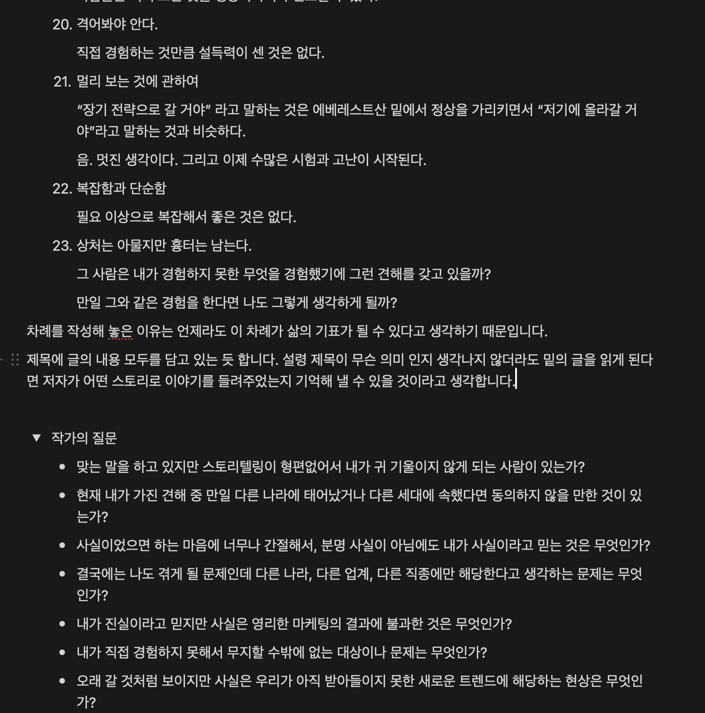

# Week 2 (24.07.29 ~ 24.08.02)

## 월요일

- 학습 내용:
  1. 알고리즘 백준 2611(시간초과)위상정렬 -> 미해결
  2. 알고리즘 스터디
  3. 독서토론 준비
- 느낀 점: DP쪽에 좀 약한듯하다 머리속에 그림이 그려지지 않았다. 금일은 병원을 다녀와서 오전시간이 없었고 오후에 스터디를 했으며 이후에는
  독서토론을 준비해야하기때문에(미리 준비를 못함) 많은 것을 하지는 못해서 아쉬운 날이다.

## 화요일

- 학습 내용:

  1. 알고리즘 백준 1개 3273(투포인터)
  2. 독서내용 생각 및 정리(일부)
  3. CS스터디 준비(메모리/ 스레드와 멀티프로세싱) 면접을위한CS전공 지식노트
  4. CS스터디외 딥한 CS 공부/ 나혼자 공부하는 운영체제 (일부)
     

- 느낀 점:
  1. 투포인터에 대해서 이전에 한번했을때 참여하지 못했었기 때문에 처음 접하였는데 코드를 확인하지않고 알고리즘이 작동하는 방식에 대해서 먼저 이해해보려고 했기 때문에 수월하게 풀었다. 다음에도 이런식으로 진행하려고한다. 강의를 시청하는 방식이었다.
  2. CS스터디를 준비하기 위해서 스레드와 멀티프로세싱 파트쪽을 읽어보았다. 이전에 앞쪽에서 공부했던 내용들이 점차적으로 생각이 안나는 경우가 많았기 때문에 헷갈리는 단어가 나오면 검색하면서 진행하였는데 시간이 오래 걸렸다. 하지만 모든 내용을 탄탄하게 아는것이 중요하다고 생각하기 때문에 계속이런식으로 진행하려고한다. 또한 조금더 심화학습을 위해 다음책을 구매하였기 때문에 내일은 그것을 살펴볼 예정이다.
  3. 이번에 읽은 책은 SAME AS EVER이라는 책이고 내가 고른 책이다. 최근에 읽은 책이 얼마 되지는 않지만 추천한다.

## 수요일

- 학습 내용:
- 느낀 점:

## 목요일

- 학습 내용:
- 느낀 점:

## 금요일

- 학습 내용:
- 느낀 점:

---

> 한 주 총평:

# Week 1 (24.07.22 ~ 24.07.26)

## 월요일

- 학습 내용:
  1. 금일 스케줄 정리
  2. 알고리즘 스터디 문제 중 1문제 디버깅
  3. cs스터디(면접을 위한 cs 전공지식노트) 읽기
  4. 알고리즘 스터디
  5. 오픽 챕터1
  6. 알고리즘 한문제 풀기 (문제 미정)
  7. 자기전에 책읽기(Same as Ever)
- 느낀 점:
  아침을 조금 일찍시작하는게 보람차게 느껴졌고
  CS의 경우 공룡책을 살지 나혼공을 살지 아직 정하지 못했기 때문에 정해서 구매하고 내일이나 내일모레 한번 읽어보려고한다.
  오픽의경우 아직 감을 못잡겠다. 책에서는 스크립트를 외우지 말고 하라고 하는데 어느정도까지 가능할지 실제로 해본적이 없어서 아직은 잘 모르겠다.
  책을 3권정도 구비해놨기 때문에 빠르게 해가려고 생각중이고... 시험은 한권부터 끝내고 시작하려고한다. 10일정도 예정이다.
  알고리즘의 경우는 많이 풀어보는게 중요하다고 생각이 들고 반복적으로 푸는것도 중요할 것이라고 생각하기 때문에 쉬운문제라도 하루에 하나씩 풀어보려고한다.

## 화요일

- 학습 내용:
  1. 금일 스케줄 정리
  2. 알고리즘 스터디문제 풀기(실패 2611)
  3. 오픽 2챕터
  4. CS정리 노션
- 느낀 점:
  알고리즘이 생각보다 여려워서 1일1알고를 실패했다. 실버나 브론즈로 대체할 예정이긴하나 아쉬웠다.
  오픽이 생각보다 어렵게 느껴진다. 문장을 길게 말할수 있을지 걱정이된다.
  CS정리가 생각보다 어렵다. 책에 내용이 부실해서 그런듯하다. 다른방법이 절실히다.

## 수요일

- 학습 내용:
  1. 알고리즘 스터디 문제 풀기
  2. CS 정리
- 느낀 점: 알고리즘이 생각보다 부실하다고 생각된다.

## 목요일

- 학습 내용:
  1. 알고리즘 스터디 문제 풀기
  2. CS 정리
- 느낀 점: 스터디문제를 차근차근 해내어 미리 풀어 내어 잘했다고 생각이 들고 컴퓨팅 사고에 cs가 도움이 되는것 같다.

## 금요일

- 학습 내용:
  1. 알고리즘 스터디 문제 풀기
  2. CS 정리
- 느낀 점: 지각 1회를 달성하였다 앞으로 늦지 않을 예정이다.

---

> 한 주 총평: 성실하게 이행하지 못한듯하여 다음오는주에는 성실히 임할 예정이다.
